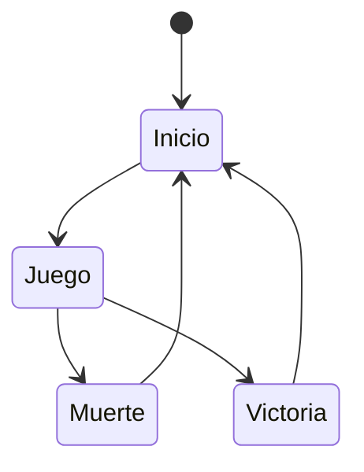

# IAV - Base para la Práctica 1

## Autores
- Nombre completo (Usuario GitHub)
- Nombre completo (Usuario GitHub)
- Nombre completo (Usuario GitHub)

## Propuesta
Esta práctica consiste en... 

El avatar del jugador será el **flautista**, que...

Las **ratas** tendrán el siguiente comportamiento:...

...

## Punto de partida
Se parte de un proyecto base de Unity proporcionado por el profesor aquí:
https://github.com/Narratech/IAV-P1

Consiste en... 

## Diseño de la solución

Lo que vamos a realizar para resolver esta práctica es...

El pseudocódigo del algoritmo de llegada utilizado es:
```
class Arrive:
    character: Kinematic
    target: Kinematic

    maxAcceleration: float
    maxSpeed: float

    # The radius for arriving at the target.
    targetRadius: float

    # The radius for beginning to slow down.
    slowRadius: float

    # The time over which to achieve target speed.
    timeToTarget: float = 0.1

    function getSteering() -> SteeringOutput:
        result = new SteeringOutput()

        # Get the direction to the target.
        direction = target.position - character.position
        distance = direction.length()

        # Check if we are there, return no steering.
        if distance < targetRadius:
            return null

        # If we are outside the slowRadius, then move at max speed.
        if distance > slowRadius:
            targetSpeed = maxSpeed
        # Otherwise calculate a scaled speed.
        else:
            targetSpeed = maxSpeed * distance / slowRadius

        # The target velocity combines speed and direction.
         targetVelocity = direction
        targetVelocity.normalize()
        targetVelocity *= targetSpeed

        # Acceleration tries to get to the target velocity.
        result.linear = targetVelocity - character.velocity
        result.linear /= timeToTarget

        # Check if the acceleration is too fast.
        if result.linear.length() > maxAcceleration:
            result.linear.normalize()
            result.linear *= maxAcceleration

        result.angular = 0
        return result
```

El pseudocódigo del algoritmo de movimiento de huida es...

También es posible mostrar diagramas...


Mejor que insertando imágenes, se puede usar Mermaid:



Para dibujar espacios de coordenadas 2D con puntos y vectores, se podría incrustar una imagen de Google Draw, o intentar incrustarlo en el repositorio también con Mermaid. 

## Pruebas y métricas

Plan de pruebas dividido por características (C1, C2 y C3 serían las 3 pruebas que se han realizado de la característica C)
- [Vídeo con la batería de pruebas](https://youtu.be/xxxxx)

## Ampliaciones

Se han realizado las siguientes ampliaciones

- Los obstáculos del escenario se colocan...

## Producción

Las tareas se han realizado y el esfuerzo ha sido repartido entre los autores.

| Estado  |  Tarea  |  Fecha  |  
|:-:|:--|:-:|
| ✔ | Diseño: Primer borrador | 2-12-2022 |
| ✔ | Característica A: Nosequé | 11-12-2022 |
| ✔ | Característica B: Nosecuentos| 12-12-2022 |
|   | ... | |
|  | OPCIONAL |  |
| ✔ | Generador pseudoaleatorio | 3-12-2022 |
| :x: | Menú | 3-12-2022 |
| :x: | HUD | 12-12-2022 |

## Referencias

Los recursos de terceros utilizados son de uso público.

- *AI for Games*, Ian Millington.
- [Kaykit Medieval Builder Pack](https://kaylousberg.itch.io/kaykit-medieval-builder-pack)
- [Kaykit Dungeon](https://kaylousberg.itch.io/kaykit-dungeon)
- [Kaykit Animations](https://kaylousberg.itch.io/kaykit-animations)
